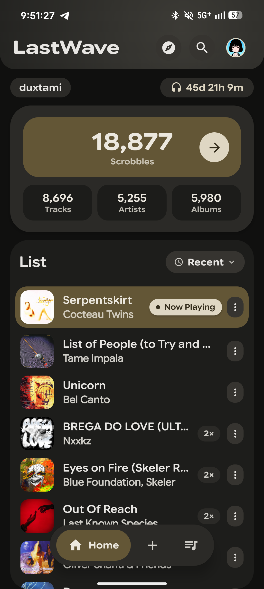
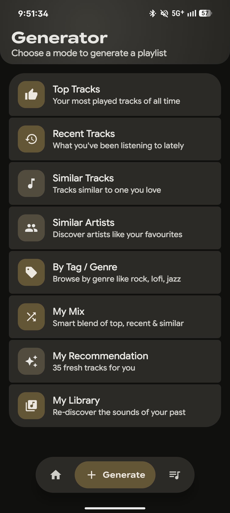
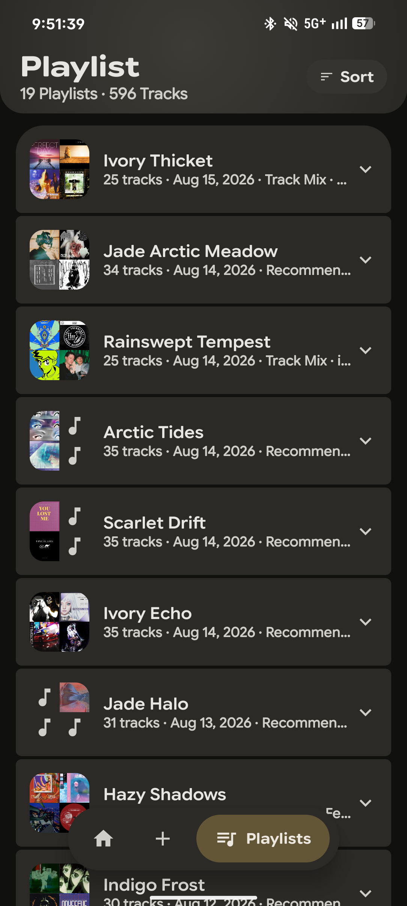
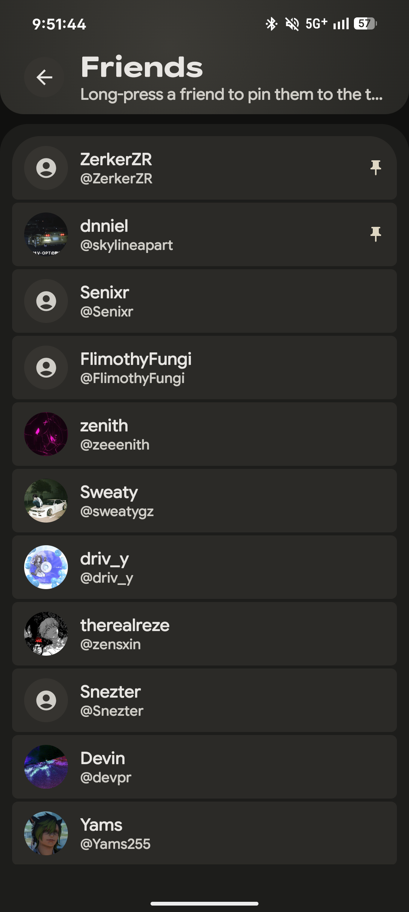
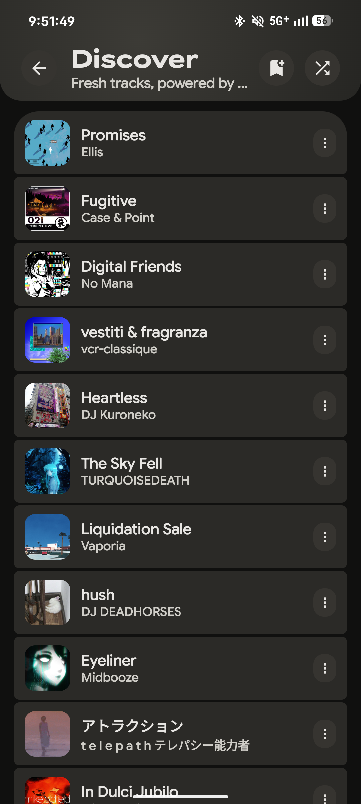
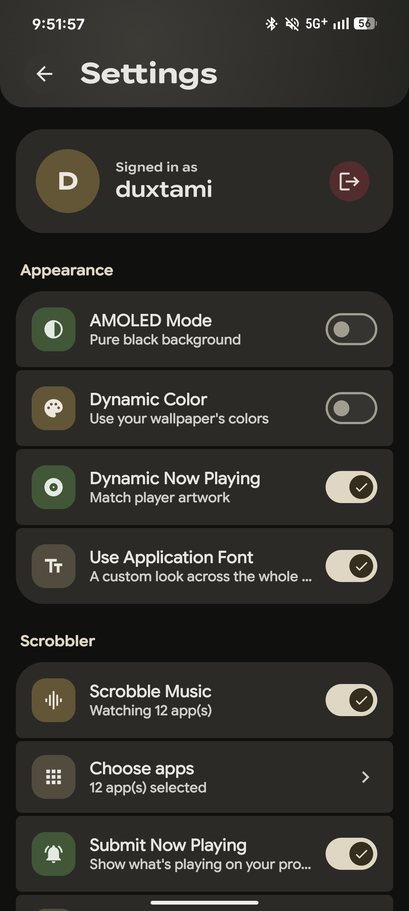

<div align="center">

# ✨ SpotiAisexs

**A fully-featured Last.fm client and scrobbler for Android, built with Material 3 Expressive design.**

<p align="center">
  <a href="https://github.com/duxtami/SpotiAisexs-native/stargazers">
    
  </a>
  <a href="https://github.com/duxtami/SpotiAisexs-native/network/members">
    
  </a>
  <a href="#">
    
  </a>
</p>

</div>

<br/>

<div align="center">
  
  
  
  <br/>
  <br/>
  
  
  
</div>

<br/>

## About

SpotiAisexs is a native Android client for Last.fm — built with Jetpack Compose and designed around Material 3 Expressive. It comes with its own scrobbler built in,  Sign in with your Last.fm account, grant notification access, and it just tracks what you're playing — from any app.

---

## Core Features

| Feature | Description |
|:---|:---|
| 🏠 **Home Feed** | Recent tracks, most played, top tracks by period (7 days / 30 days / all-time), and a live Now Playing status. |
| 🔮 **Discover** | A recommendation feed built from similar tracks, similar artists, loved tracks, tags, and global charts. |
| 🎸 **Genres** | A breakdown of your genre listening habits. |
| 🪄 **Playlist Generator** | Builds playlists straight from your Last.fm data. |
| 🔍 **Search** | Tracks, artists, albums, and other Last.fm users. |
| 👥 **Friends** | Switch to any friend's profile and browse their stats. |
| ⚙️ **Settings** | Backup and restore, plus appearance customization. |

---

## The Scrobbler


- Detects what's playing through Android's own MediaSession framework — works with whatever app you're already using, no extra setup per-app beyond picking which apps to watch.
- You choose which apps it pays attention to, and it can auto-detect common music players for you.
- Scrobble threshold (% played before it counts) is adjustable.
- Handles repeats, resuming a paused track, and switching between apps correctly — these are easy to get wrong, so I spent real time on them.
- Strips the "- Topic" suffix YouTube Music adds to auto-generated channel names, so your artist names stay clean.
- Has a live debug log in Settings, so if something isn't scrobbling you can actually see why instead of guessing.

---

## Design

Built around Material 3 Expressive — grouped containers, real press animations, and haptics where they matter, not just sprinkled everywhere.

- Material You dynamic color from your wallpaper, plus a Dynamic Now Playing theme that pulls its accent from whatever's currently playing.
- Native Android Predictive Back support.
- Custom variable typography using Google Sans Flex.

---

## Tech Stack

- Kotlin + Jetpack Compose
- Hilt, Room, DataStore
- Retrofit + OkHttp
- Last.fm API

<br/>

## Getting Started

1. Install SpotiAisexs.
2. Open it and tap **Connect with Last.fm** — this opens Chrome to sign in, so your password never touches the app itself.
3. Grant notification access when asked, so the scrobbler can see what's playing.
4. That's it — your stats and feed load automatically from there.

## Building from Source

```bash
git clone https://github.com/duxtami/SpotiAisexs-native.git
cd SpotiAisexs-native
./gradlew assembleDebug
```

<div align="center">
  <p>Built by  <a href="https://github.com/duxtami">Duxtami</a>.</p>
</div> 
